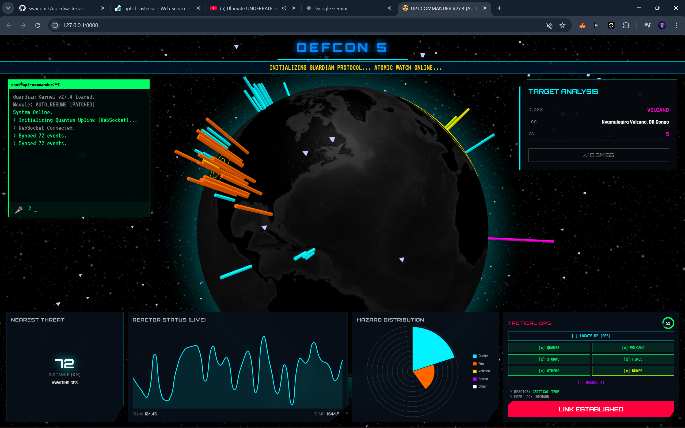

# ☢️ UPT Disaster AI - Guardian System

> Hệ thống theo dõi thảm họa thời gian thực kết hợp mô phỏng Lò phản ứng lượng tử (Quantum Reactor Simulation).

## 🌟 Tính năng nổi bật

- **Real-time Monitoring:** Quét dữ liệu động đất (USGS) và sự kiện thiên nhiên (NASA EONET) mỗi 5 phút.
- **Quantum Reactor Core:** Mô phỏng độ ổn định của lò phản ứng dựa trên dữ liệu địa chấn thực tế.
- **3D Visualization:** Giao diện địa cầu tương tác với Three.js & Globe.gl.
- **Guardian AI:** Hệ thống cảnh báo tự động qua Telegram Bot.
- **Voice Command:** Điều khiển giao diện bằng giọng nói ("Scan", "Locate", "Status"...).

## 🛠 Tech Stack

- **Backend:** Python, FastAPI, APScheduler (Background Tasks), WebSockets.
- **Frontend:** HTML5, CSS3 (Cyberpunk Style), Three.js, TensorFlow.js (Lite).
- **Deployment:** Docker, Render Cloud.

## 🚀 Cài đặt & Chạy

1. Clone repo: `git clone ...`
2. Tạo file `.env` (xem `.env.example`).
3. Chạy Docker:
   ```bash
   docker build -t upt-ai .
   docker run -p 8000:8000 upt-ai
   ```
   📸 Screenshots
   

### 3. Chuyển `print()` sang `logging` (Backend Standard)

Trong code Python chuyên nghiệp, chúng ta hạn chế dùng `print()` vì nó không có timestamp và khó quản lý cấp độ lỗi.

Bạn có thể tạo một file cấu hình log đơn giản hoặc sửa `app/main.py` thêm đoạn này vào đầu:

```python
import logging

# Cấu hình logging để hiện giờ và cấp độ tin nhắn
logging.basicConfig(
    level=logging.INFO,
    format="%(asctime)s [%(levelname)s] %(message)s",
    handlers=[logging.StreamHandler()]
)

logger = logging.getLogger(__name__)

# Thay thế các lệnh print:
# print("Starting...")  -> logger.info("Starting...")
# print("Error: ...")   -> logger.error("Error: ...")
```
