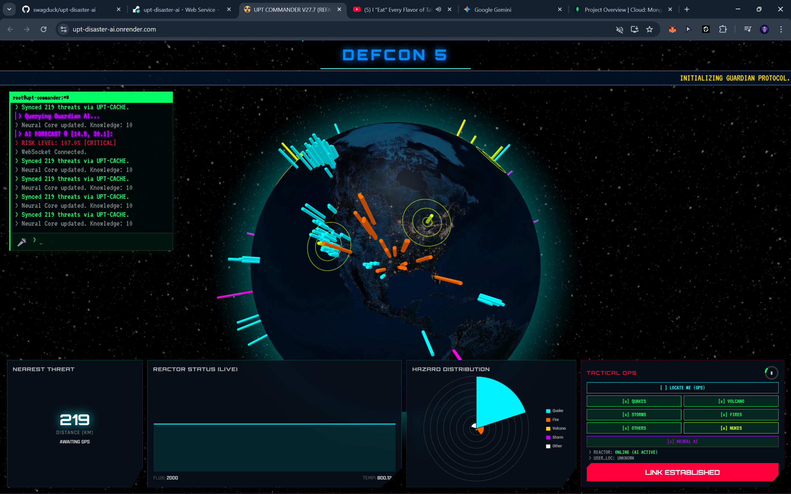

# ☢️ UPT Disaster AI - Guardian System

[](https://python.org)
[](https://fastapi.tiangolo.com)
[](LICENSE)
[](https://docker.com)
[](https://mongodb.com)

> **Advanced Global Disaster Monitoring & Quantum Reactor Stability System**

A cutting-edge real-time global disaster monitoring platform that combines seismic data analysis, quantum reactor stability simulation, and AI-powered risk forecasting. Built with a cyberpunk aesthetic, delivering an authentic defense command center experience.

---

## 🌟 Core Features

### 📡 **Multi-Source Real-Time Monitoring**

- **Global Sensor Network**: Automatic scanning of earthquake data from USGS, natural disasters (volcanoes, wildfires, storms) from NASA EONET, and solar storms from NASA DONKI every 60 seconds
- **Snapshot Database**: Stores all fluctuations in MongoDB Atlas for AI training and historical analysis
- **WebSocket Streaming**: Real-time data delivery to frontend clients

### ⚛️ **Quantum Reactor Core Simulation**

- **Realistic Coupling**: Major disasters (earthquakes > 6.0) cause direct "shock" effects on the reactor, fluctuating core temperature, neutron flux, and stability coefficient $K_{eff}$
- **SCRAM System**: Automatic or manual emergency reactor shutdown when temperature exceeds safety threshold (2000K)
- **Real-time Monitoring**: Live tracking of reactor parameters with predictive analytics

### 🧠 **Guardian AI Intelligence**

- **Deep Learning (LSTM)**: Long Short-Term Memory neural networks for forecasting disaster intensity based on time-series data
- **Neural Prediction**: Risk level forecasting at any global coordinate based on geological fire belt knowledge
- **Pattern Recognition**: Advanced algorithms for identifying disaster precursors and trends

### 🎮 **Advanced Interface & Control**

- **3D Visualizer**: Interactive 3D globe displaying disaster locations, nuclear facilities, and risk forecast zones
- **Voice Command System**: Voice-controlled operations: Scan, Locate me, Status, Matrix, and more
- **Tactical HUD**: Command panel with DEFCON indicators and intuitive risk distribution charts
- **Cyberpunk UI**: Immersive interface design with neon aesthetics and futuristic elements

---

## 🛠 Technology Stack

### Backend

- **Python 3.11** - Core programming language
- **FastAPI** - High-performance async web framework
- **WebSockets** - Real-time bidirectional communication
- **MongoDB Atlas** - Cloud-based NoSQL database
- **APScheduler** - Advanced task scheduling

### Frontend

- **HTML5/CSS3** - Modern web standards with cyberpunk design
- **Three.js** - 3D graphics and visualization
- **Globe.gl** - Interactive globe rendering
- **Chart.js** - Dynamic data visualization

### AI/ML

- **TensorFlow** - Deep learning framework for LSTM models
- **Scikit-Learn** - Machine learning algorithms (Random Forest, Scaler)
- **NumPy** - Numerical computing and data analysis
- **Pandas** - Data manipulation and analysis

### DevOps

- **Docker** - Containerization and deployment
- **Shell Scripting** - Automation and system management
- **GitHub Actions** - CI/CD pipeline (if configured)

---

## 🚀 Quick Start

### Prerequisites

- Python 3.11+
- MongoDB Atlas account
- NASA API key
- Docker (optional)

### 1. Environment Configuration

Create a `.env` file in the project root:

```env
MONGO_URI=your_mongodb_uri
DB_NAME=upt_guardian
NASA_API_KEY=your_nasa_key
TELEGRAM_TOKEN=your_bot_token
TELEGRAM_CHAT_ID=your_chat_id
PORT=8000
```

### 2. Docker Deployment (Recommended)

```bash
# Build the image
docker build -t upt-disaster-ai .

# Run the container
docker run -p 8000:8000 --env-file .env upt-disaster-ai
```

### 3. Manual Installation

```bash
# Install dependencies
pip install -r requirements.txt

# Run the application
python -m app.main
```

The system will be available at: **http://localhost:8000**

---

## 🎮 System Commands (Terminal)

| Command         | Function                                    |
| --------------- | ------------------------------------------- |
| `scan`          | Manual satellite data scan                  |
| `locate`        | Determine operator GPS position             |
| `train`         | Force AI system to relearn from cached data |
| `scram`         | Emergency reactor shutdown                  |
| `defcon [1-5]`  | Change defense readiness level              |
| `mute / unmute` | Control system audio                        |

---

## 📸 System Interface



_Main command center interface with real-time monitoring and 3D visualization_

---

## 🏗 Project Structure

```
upt-disaster-ai/
├── app/
│   ├── api/v1/endpoints/     # API routes
│   ├── services/             # Business logic services
│   ├── upt_engine/           # Core reactor simulation
│   └── static/               # Frontend assets
├── alembic/                  # Database migrations
├── tests/                    # Test suite
├── docker-compose.yml        # Docker configuration
├── Dockerfile               # Container definition
└── requirements.txt         # Python dependencies
```

---

## 🔧 API Endpoints

### Core System

- `GET /` - Main interface
- `GET /api/v1/status` - System status
- `GET /api/v1/health` - Health check

### Reactor Control

- `GET /api/v1/reactor/status` - Reactor parameters
- `POST /api/v1/reactor/scram` - Emergency shutdown
- `GET /api/v1/reactor/history` - Historical data

### AI Prediction

- `GET /api/v1/predict/risk` - Risk assessment
- `POST /api/v1/predict/forecast` - Disaster forecasting
- `GET /api/v1/predict/model/status` - AI model status

---

## 📊 Real-Time Data Sources

| Source            | Data Type         | Update Frequency |
| ----------------- | ----------------- | ---------------- |
| **USGS**          | Earthquake data   | Real-time        |
| **NASA EONET**    | Natural disasters | Every 60s        |
| **NASA DONKI**    | Solar storms      | Every 60s        |
| **MongoDB Atlas** | Historical data   | Continuous       |

---

## 🎯 Use Cases

### **Emergency Management**

- Real-time disaster monitoring and alerting
- Risk assessment for critical infrastructure
- Evacuation planning support

### **Research & Analysis**

- Pattern recognition in disaster occurrence
- Climate change impact studies
- Geological research

### **Education & Training**

- Interactive learning about natural disasters
- Reactor safety training simulation
- Data visualization demonstrations

---

## 🔮 Future Development

- [ ] Mobile application for field operations
- [ ] Enhanced AI models with satellite imagery
- [ ] Integration with additional global monitoring systems
- [ ] Advanced predictive analytics dashboard
- [ ] Multi-language support

---

## 🤝 Contributing

We welcome contributions! Please see our [Contributing Guidelines](CONTRIBUTING.md) for details.

1. Fork the repository
2. Create your feature branch (`git checkout -b feature/AmazingFeature`)
3. Commit your changes (`git commit -m 'Add some AmazingFeature'`)
4. Push to the branch (`git push origin feature/AmazingFeature`)
5. Open a Pull Request

---

## ⚠️ Disclaimer

**This is a simulation system for educational and research purposes only.**
Do not rely on this system for actual emergency response or safety-critical decisions. Always follow official emergency management guidelines and authorities' instructions.

---

## 📞 Contact

- **Project Maintainer**: [Your Name](mailto:your.email@example.com)
- **Issues & Bug Reports**: [GitHub Issues](https://github.com/yourusername/upt-disaster-ai/issues)
- **Discussions & Questions**: [GitHub Discussions](https://github.com/yourusername/upt-disaster-ai/discussions)

---

<div align="center">

**🌟 If this project inspires you, give it a star! 🌟**

_Built with passion for disaster monitoring and AI technology_

</div>
